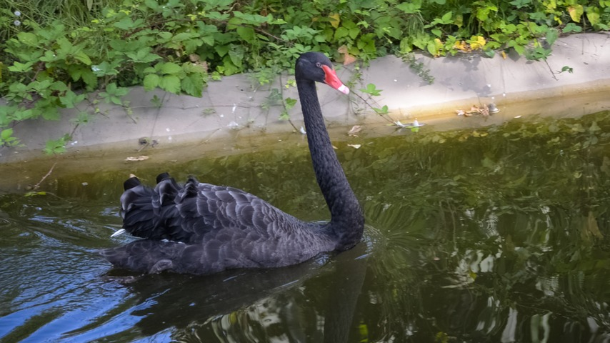
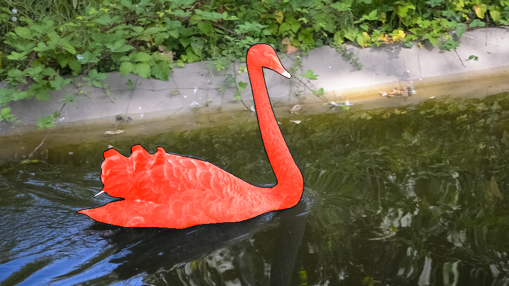

# Some_Codes
 
## Here I will store some codes for any use, maybe for visualization, image save or some other purpose.
 
## The code list:

### vos_visualize
Combine mask and image together and add contour of the mask to the final image
The code will auto save the result
based on davis_2017,but modified

The visual effect is as follows:

