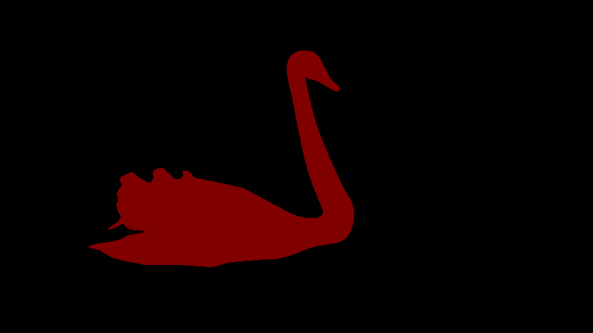
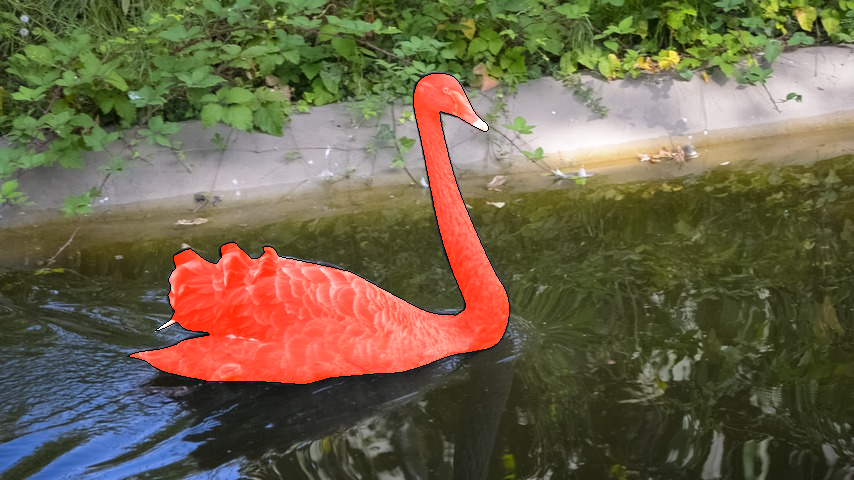

# Some_Codes
 
## Here I will store some codes for any use, maybe for visualization, image save or some other purpose.
 
## The code list:

### add_colour.py
Combine mask and image together and add contour of the mask to the final image
The code will auto save the result
The colour map can be changed ,and default colour map is cv2.COLORMAP_AUTUMN, whose effect is similar to the quality effect in some papers

The visual effect is as follows:

<figure class="third">
    
</figure>

